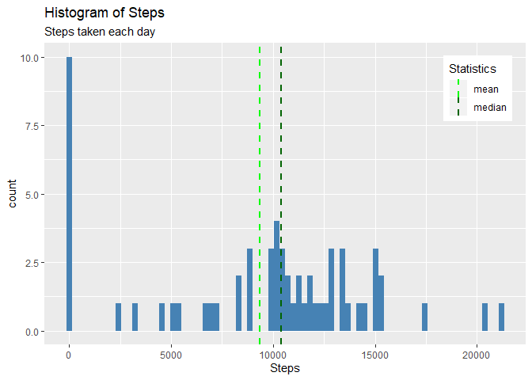
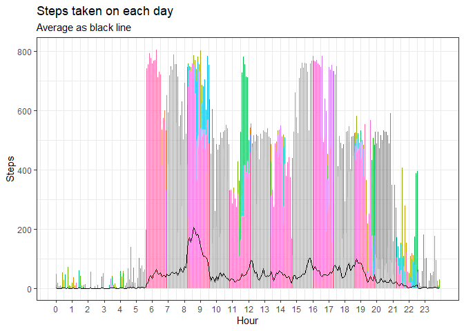
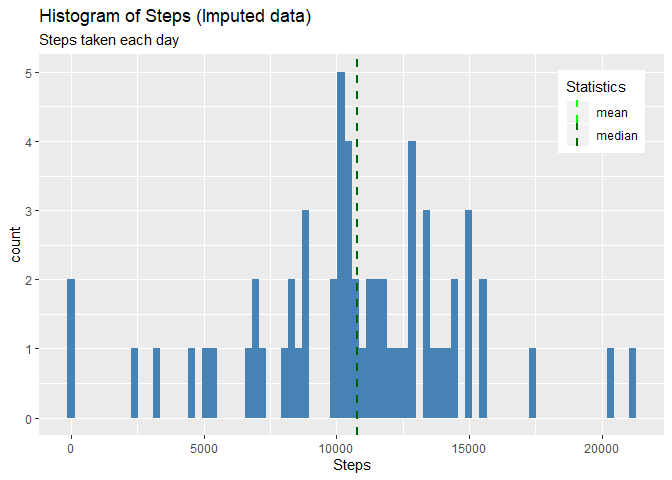
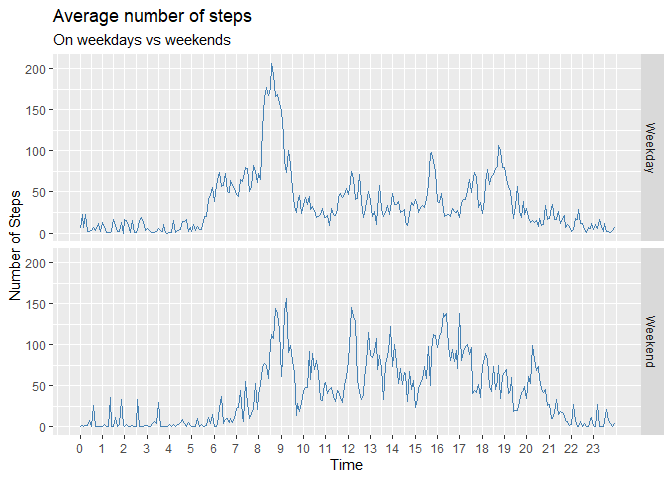

## Defining the sapplyNames function
The sapply Names function is created to apply a fuction like sum, mean, etc to a list split based on a factor. It returns a dataframe with the labels of the factor in the second column. The names of the column are also updated based on the input.


```r
sapplyNames = function(List, FUN, Names, ...){
    a = sapply(List, FUN, ...)%>%
        as.data.frame()
    a$x = row.names(a)
    row.names(a) = NULL
    names(a) = Names
    a
}
```

Further, packages are loaded to help with the analyses

```r
library(lubridate)
library(dplyr)
library(ggplot2)
library(tidyr)
library(mice)
```
## Loading and preprocessing the data
The data is loaded into the variable activity. As part of the preprocessing, the columns are changed to the appropriate formate. Also, the column interval is saved as a new variable for further reference

```r
activity = read.csv('activity.csv', stringsAsFactors = F)
activity = mutate(activity, date = ymd(date))
interval = activity$interval
activity = separate(activity, interval, into = c('hours', 'minutes'), sep = -2)
activity$hours[activity$hours == ''] = 0
activity = mutate(activity, hours = round(as.numeric(hours),digits = 2))%>%
    mutate(time = paste(hours, minutes, sep = ':'))%>%
    mutate(dateTime = ymd_hm(paste(date,time)))%>%
    mutate(Time = format(as.POSIXct(time, format = '%H:%M'), '%H:%M'))%>%
    mutate(Time = parse_date_time2(Time, orders = 'HM',tz = 'GMT'))
```
The resulting data looks like this:

```
##   steps       date hours minutes time            dateTime                Time
## 1    NA 2012-10-01     0       0  0:0 2012-10-01 00:00:00 0000-01-01 00:00:00
## 2    NA 2012-10-01     0       5  0:5 2012-10-01 00:05:00 0000-01-01 00:05:00
## 3    NA 2012-10-01     0      10 0:10 2012-10-01 00:10:00 0000-01-01 00:10:00
## 4    NA 2012-10-01     0      15 0:15 2012-10-01 00:15:00 0000-01-01 00:15:00
## 5    NA 2012-10-01     0      20 0:20 2012-10-01 00:20:00 0000-01-01 00:20:00
## 6    NA 2012-10-01     0      25 0:25 2012-10-01 00:25:00 0000-01-01 00:25:00
```

## What is mean total number of steps taken per day?
To better visualise the data, the steps walked is calculated for every day and a histogram of the data is plotted.

```r
activityDate    = split(activity$steps, activity$date)
dailyActivity   = sapplyNames(activityDate, sum, c('steps', 'date'), na.rm = T)
dailyActivity   = mutate(dailyActivity, date = ymd(date))

avg         = mean(dailyActivity$steps, na.rm = T)
mdin        = median(dailyActivity$steps, na.rm = T)

ggplot(dailyActivity, aes(steps)) + 
    geom_histogram(fill = 'steelblue', bins = 80) + 
    labs(x = 'Steps', title = 'Histogram of Steps', subtitle = 'Steps taken each day')+
    geom_vline(aes(xintercept = avg, color = 'mean'), linetype="dashed", size = 1) + 
    geom_vline(aes(xintercept = mdin, color = 'median'), linetype="dashed", size = 1) +
    scale_color_manual(name = 'Statistics', values = c(mean = 'green', median = 'darkgreen'))+ 
    theme(legend.position = c(0.9,0.85))
```

<!-- -->
<br/>On average, the participant takes 9354 steps every day, with a median of 10395.

## What is the average daily activity pattern?
The average daily activity pattern is calculated using the sapplyNames function. The activity data is first split by the intervals and then the mean for every interval is calculated. The x-ticks and x-labels are set manually to avoid the dates with the time on the x-axis.

```r
## calculate the average steps taken, by time interval
activityInterval = split(activity$steps, interval)
intervalActivity = sapplyNames(activityInterval, mean, c('steps', 'interval'), na.rm = T)

xticks = paste(round(0:23, digits = 2),'00', sep = ':') %>%
    parse_date_time2('HM')
xlabels = round(0:23, digits = 2)
ggplot(activity, aes(x = Time, y = steps, color = as.factor(activity$date), group = 61)) + 
    geom_line(show.legend = F) + 
    geom_line(aes(x = activity$Time, y = rep(intervalActivity$steps, times = 61),
                  color = 'Average'), color = 'black', show.legend = T)+
    labs(x= 'Hour', y = 'Steps', title = 'Steps taken on each day',
         subtitle = 'Average as black line') +
    theme_bw() + theme(legend.position = 'none')+
    scale_x_time(breaks = xticks, labels= xlabels)
```

<!-- -->

<br/>On average, the participant is most active between 8 and 9:30 in the morning. He/She walks the most at 08:35:00 in the morning, walking an average of 206 steps within the five minute interval.

## Imputing missing values
Using the mice package, we can analyse the missing data and impute them. The dataset contains 17568 observations. The following table shows that the missing data is limited to the 'steps' column. A total of 2304 observations don't have the number of steps. This represents 13 percent of the total data. 

```r
activity = select(activity, steps, date, time )
md.pattern(activity, plot = F) 
```

```
##       date time steps     
## 15264    1    1     1    0
## 2304     1    1     0    1
##          0    0  2304 2304
```
To impute this missing data, the mice package is used. The package uses Multivariate Imputation via Chained Equations to impute the missing data. To impute the number of steps, the 'pmm' (Predictive Mean Matching) method was chosen as it the most suitable method for continuous data.<br/>The summary of the imputed data is compared with the original. With a seed = 1, the most similar output, 4th, is selected. 


```r
tempActivity    = mice(activity, method = 'pmm', seed = 1, print = FALSE)
with(activity, summary(steps))
```

```
##    Min. 1st Qu.  Median    Mean 3rd Qu.    Max.    NA's 
##    0.00    0.00    0.00   37.38   12.00  806.00    2304
```

```r
with(tempActivity$imp, summary(steps))
```

```
##        1                2                3                4                5          
##  Min.   :  0.00   Min.   :  0.00   Min.   :  0.00   Min.   :  0.00   Min.   :  0.000  
##  1st Qu.:  0.00   1st Qu.:  0.00   1st Qu.:  0.00   1st Qu.:  0.00   1st Qu.:  0.000  
##  Median :  0.00   Median :  0.00   Median :  0.00   Median :  0.00   Median :  0.000  
##  Mean   : 24.31   Mean   : 28.28   Mean   : 26.26   Mean   : 37.51   Mean   :  0.293  
##  3rd Qu.:  0.00   3rd Qu.:  0.00   3rd Qu.:  0.00   3rd Qu.: 16.00   3rd Qu.:  0.000  
##  Max.   :568.00   Max.   :753.00   Max.   :785.00   Max.   :770.00   Max.   :117.000
```

```r
impActivity     = complete(tempActivity, 4)
```
The activity dataset was visualised with the imputed data. The histogram of the steps walked each day is plotted with the new mean and median values as vertical lines. As the two values are almost equal to eachother, they are plotted behind eachother in this plot.

```r
impActivityDate = split(impActivity$steps, impActivity$date)
dailyImpActivity = sapplyNames(impActivityDate, sum, c('steps', "date")) 
dailyImpActivity = mutate(dailyImpActivity, date = ymd(date))

# Mean and median number of steps taken each day
avgimp = mean(dailyImpActivity$steps)
mdinimp = median(dailyImpActivity$steps)

ggplot(dailyImpActivity, aes(steps)) + 
    geom_histogram(fill = 'steelblue', bins = 80) + 
    labs(x = 'Steps', title = 'Histogram of Steps (Imputed data)', subtitle = 'Steps taken each day')+
    geom_vline(aes(xintercept = avgimp, color = 'mean'), linetype="dashed", size = 1) + 
    geom_vline(aes(xintercept = mdinimp, color = 'median'), linetype="dashed", size = 1) +
    scale_color_manual(name = 'Statistics', values = c(mean = 'green', median = 'darkgreen'))+ 
    theme(legend.position = c(0.9,0.85))
```

<!-- -->
<br/>The average daily steps walked in the imputed data is 1.0771\times 10^{4} and the median is 1.0765\times 10^{4}.

## Are there differences in activity patterns between weekdays and weekends?
Plotting the number of steps on weekdays and weekends can give us more information about the participant's activity. 

```r
Days = weekdays(impActivity$date)
weekend = Days %in% c('Saturday', 'Sunday')
impActivity$Weekday = 'Weekday'
impActivity$Weekday[weekend] = 'Weekend'
impActivity = mutate(impActivity, Weekday = as.factor(Weekday))
impActivityS = split(impActivity[,1], impActivity[c('Weekday', 'time')])
avgStepsWeekday = sapplyNames(impActivityS, mean, c('Steps', 'Weekday.time'))%>%
    separate(Weekday.time, into = c('Weekday', 'time'), sep = '\\.')%>%
    mutate(Time = parse_date_time(time, orders = 'HM'))%>%
    mutate(Weekday = as.factor(Weekday))
ggplot(avgStepsWeekday, aes(Time, Steps))+
    geom_line(col = 'steelblue') + 
    facet_grid(rows = avgStepsWeekday$Weekday) + 
    labs(x = 'Time', y = 'Number of Steps', title = 'Average number of steps', subtitle = 'On weekdays vs weekends')+
    scale_x_time(breaks = xticks, labels = xlabels)
```

<!-- -->
<br/>In weekends, the particpant walks 1726 more than on weekdays. However, it is spread over most of the day, while on weekdays, a large proportion of the steps are within a short period of time. On weekdays, he/she walks more than 100 steps every 5min between 8 and 9 in the morning.
